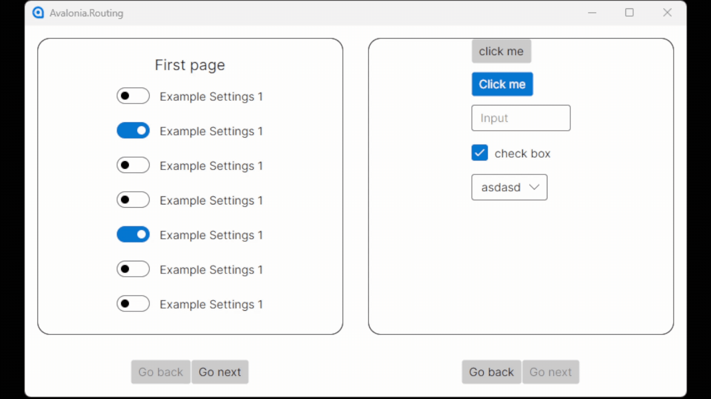

# 🚀 Avalonia.ReactiveUI.Routing  
Пример проекта на Avalonia + ReactiveUI, построенный по паттерну MVVM и с использованием Dependency Injection (DI)

Этот репозиторий показывает, как построить приложение на Avalonia, где **левая и правая часть окна имеют собственную навигацию**, полностью независимую друг от друга.  
Это полезно для сложных UI: панели инструментов, предпросмотр, настройки, редакторы, SCADA/HMI и т.д.

<p align="left">  </p>

---

# 🧩 Что здесь реализовано

### ✔ Два независимых навигационных дерева  
Каждая панель имеет свой `IScreen` и свой `RoutingState`.

- `LeftScreen` → навигация левой части  
- `RightScreen` → навигация правой части  

---

### ✔ ReactiveUI Routing  
Используются:

- `IScreen`
- `IRoutableViewModel`
- `RoutingState`
- `RoutedViewHost`

---

# 🖼️ Как выглядит структура проекта

```
Avalonia.Routing/
│
├── Navigation/
│   ├── LeftScreen.cs
│   └── RightScreen.cs
│
├── ViewModels/
│   ├── MainWindowViewModel.cs
│   ├── InstrumentsFirstViewModel.cs
│   ├── InstrumentsSecondViewModel.cs
│   ├── PanelsFirstViewModel.cs
│   └── PanelsSecondViewModel.cs
│
├── Views/
│   ├── MainWindow.axaml
│   ├── InstrumentsFirstView.axaml
│   ├── InstrumentsSecondView.axaml
│   ├── PanelsFirstView.axaml
│   └── PanelsSecondView.axaml
│
└── RoutingViewLocator.cs
```
---

# 🎯 Для чего это можно использовать

- Панель инструментов + рабочая область  
- Настройки + предпросмотр  
- Два разных редактора  
- SCADA/HMI интерфейсы  
- Мастер‑пошаговые формы  
- Любые сложные UI, где нужно два независимых состояния

---

# ▶️ Запуск

```bash
git clone https://github.com/mikhailSokolovskiy/Avalonia.ReactiveUI.Routing
cd Avalonia.ReactiveUI.Routing
dotnet run
```
